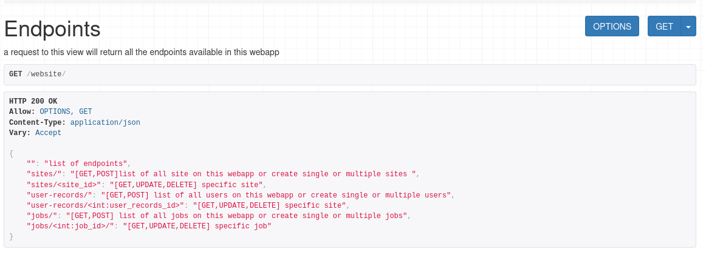
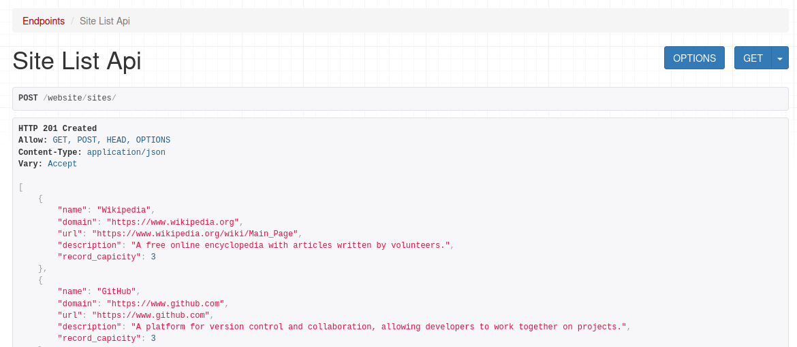
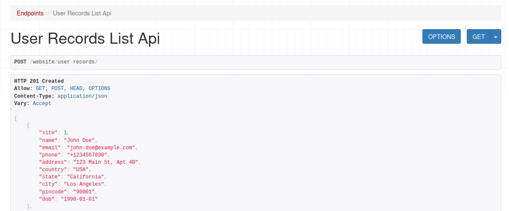
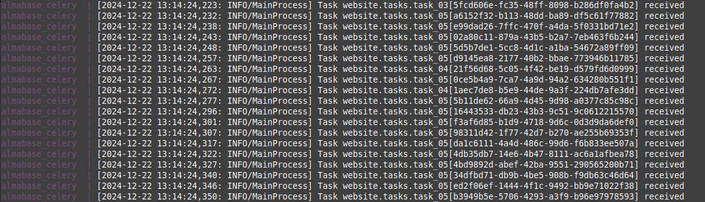
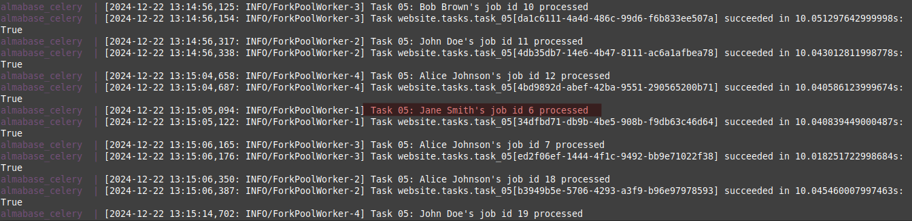
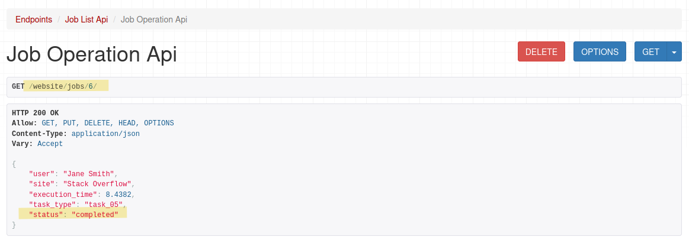
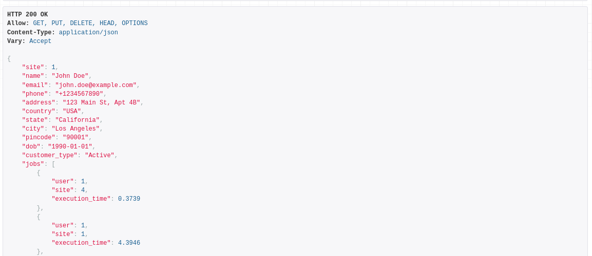

## Assignment Solution [Readme Not up to date with recent changes]
---
Read the original assignment README [here](./docs/README.md)

Assignment by: [Sarvesh Yadav](https://github.com/alexdeathway)  
Email: ccsarveshyadav@gmail.com

### Breaking down the problem statement

We need to create a system that allows us to handle different types of jobs based on their execution time and various customer types based on their record volume, while also considering resource limitations. Additionally, users are associated with sites.

```

├── Site
│   ├── UserRecord1
│   │  	    ├── JOB1
│   │       └── JOB2
│   │       
│   └── UserRecord2
│           ├── JOB3
│           ├── JOB9
│           ├── JOB10
│           └── JOB4
├── Site2
    ├── UserRecord3
    │  	    ├── JOB5
    │       └── JOB6
    │       
    └── UserRecord4
            ├── JOB7
            └── JOB8
```


#### We will break down the problem into the following objectives:
----
- Create a model for the job and assign it a type based on its execution time.
- Add additional fields to the UserRecord to handle the customer type.
  - We will have three types of customers based on how many jobs they have in the queue:
    - **Active**: Customers with fewer jobs.
    - **Very Active**: Customers with a moderate number of jobs.
    - **Hyperactive**: Customers with many jobs.
- Implement a task distributor (refer to `website/tasks.py`) that will distribute tasks based on the customer type and job type to our Celery workers.
  - We will have 5 types of jobs based on their execution time.
  - A site priority queue will be created with job and customer type to calculate the priority of the site. Refer to `website/priority.py`.
  - Sites with higher priority (i.e., those with many highly active users and less resource-intensive jobs) will be picked up by the worker first. 

## Functioning
---
### 1. Endpoints

All endpoints are available at `website/`.



### 2. Submitting and Retrieving Sites and User Records

You can submit single or multiple sites at `website/sites` or `sites`, and user records at `website/user-records` or `user-records`.

#### Site List 


#### User Record List


### 3. Submitting and Retrieving Jobs 

Submit the following batch of jobs for processing:

```json
[
    {"user": 2, "site": 1, "execution_time": 9.8887},
    {"user": 3, "site": 2, "execution_time": 0.0895},
    {"user": 5, "site": 2, "execution_time": 8.4956},
    {"user": 3, "site": 1, "execution_time": 7.4985},
    {"user": 2, "site": 4, "execution_time": 8.5381},
    {"user": 2, "site": 3, "execution_time": 8.4382},
    {"user": 3, "site": 3, "execution_time": 2.3003},
    {"user": 1, "site": 4, "execution_time": 0.3739},
    {"user": 2, "site": 1, "execution_time": 5.1969},
    {"user": 4, "site": 1, "execution_time": 4.8443},
    {"user": 1, "site": 1, "execution_time": 4.3946},
    {"user": 3, "site": 1, "execution_time": 7.4142},
    {"user": 2, "site": 4, "execution_time": 1.025},
    {"user": 2, "site": 4, "execution_time": 0.9082},
    {"user": 4, "site": 2, "execution_time": 2.428},
    {"user": 2, "site": 2, "execution_time": 2.0037},
    {"user": 1, "site": 4, "execution_time": 3.6222},
    {"user": 3, "site": 3, "execution_time": 8.155},
    {"user": 1, "site": 5, "execution_time": 4.1567},
    {"user": 4, "site": 2, "execution_time": 6.8682}
]

```

#### Job Being Received by Celery Worker


#### Job Processed Log Output


#### Getting Job Details
You can get the job details at `website/jobs/<job_id>`.


### 4. Getting User Details
Get user details and all their jobs by visiting website/user-records/<user_record_id>.


## Setting Up Development Environment

1. Create the .dev.env file (use template.dev.env for reference):

 >cp template.dev.env .dev.env

2. Start Docker:
> docker compose up --build

---

